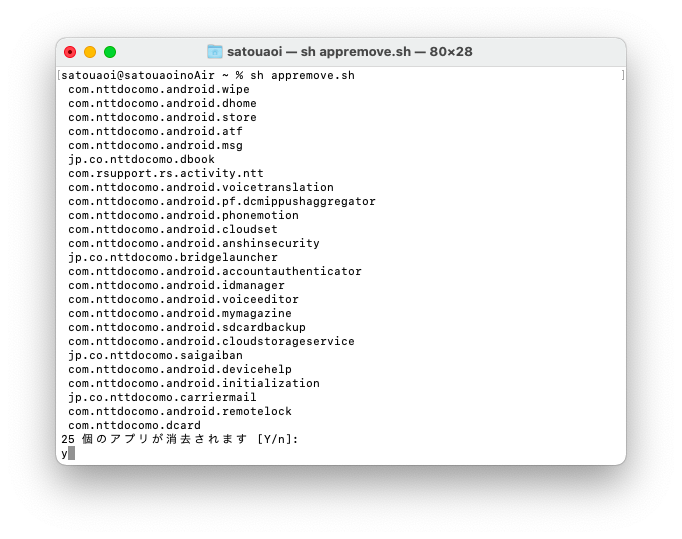

# Remove-CareerApp

通常は削除できないキャリア関連のアプリを一括で消去することができます。
このスクリプトを実行するだけで簡単にクリーンなAndroid環境が作れます。

(オマケ機能として復元機能もつけました)

# 対応OS

MacOSまたはLinux(対応Linux: Ubuntu, ArchLinux, RedHat, Fedora, VoidLinux)またはWindows。※依存関係は自動で解決されます。

※Forkした人がAndroid端末を持っていないので基本的に動作未検証です。(プログラム自体の実行の確認だけはしました。)

# 本プログラムの主な機能と特徴

本プログラムには以下の機能が含まれています。

・ドライバーやadbツールの自動インストール(Windowsは試験的サポート)

・キャリアアプリの一括消去機能

・キャリアアプリの選択消去機能

・消去したキャリアアプリの復元機能(選択機能あり)

・CURLやwgetなどの外部コマンドを極力使わない様に設計されています

・サードパーティ製のモジュールを極力使わない様にしたため、ピュアなPythonで動きます。

# 注意事項

本プログラムは本プログラムがあるフォルダに「setting.conf」と「RestoreList.txt」を作成しますが、どちらも復元や次回実行時に自動インストール機能をオフにするために必要なファイルです。

特に「RestoreList.txt」は消去したパッケージを次回復元できるように一覧として格納されています。間違えて削除等をしてしまいますと次回復元ができなくなるのでご注意ください。

# 実行する前に

(警告) アプリデータは完全に消去されるためキャリアからのサポートが受けられなくなる可能性があり、このスクリプトを実行したことによる故障や損害について開発者は責任を負いかねます。

(注意) また、本プログラムにはWindows機用にドライバーの自動インストール機能がありますが、本機能は試験段階です。
ご使用につきましては、開発者は故障や損害などの責任を一切負いかねることをご留意してください。

# 実行の仕方

Android端末でUSBデバッグ機能を有効にしパソコンへ接続します。

PCのターミナルで`RemoveCareerApp.py`を実行します。  

MacやLinuxやWindowsでの例 :) `python3 RemoveCareerApp.py`

表示されたアプリ一覧に問題がなければ「Y」を入力し、修正があれば指示に従い修正します。

以下コマンドを使用すればgitからcloneすることなく実行することも可能です

例:) `python3 -c "import requests as r; exec(r.get('https://raw.githubusercontent.com/CrossDarkrix/remove-career-app/main/RemoveCareerApp.py').content)"`

# (重要) 今後について

・削除したアプリの復元機能

・Windows版のGUI化

上記を搭載した別のプロジェクトが既にあることや、

本プログラムの開発環境がWindowsではないことやフォークした人がAndroid端末を所持していないことや本プログラムの必要性・需要性を考慮した結果、

今後はフォークした本プロジェクトを休止にしようと考えています。

今後は~[本家様](https://github.com/Aoi-Developer/remove-career-app)のプロジェクト~(本家様が削除されました)やGUI版と復元機能のついた物を開発していらっしゃる方のプロジェクトをご利用ください。

Copyright (C) 2022 aoi_satou(竹林人間)